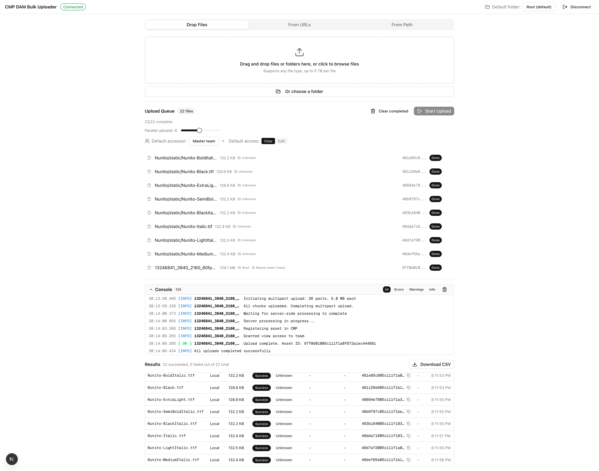

# Optimizely CMP DAM Bulk Uploader

> **Not an official Optimizely product.** This is an independent tool, entirely vibe coded with love using [Claude Code](https://claude.ai/claude-code). Use at your own discretion.

A local web application for uploading files in bulk to the Optimizely CMP (Content Marketing Platform) Digital Asset Manager. Built to handle everything from small images to massive video files up to 5 TB, with multipart chunked uploads, automatic retry logic, real-time progress tracking, and intelligent rate limiting.



## Table of Contents

- [Features](#features)
- [Prerequisites](#prerequisites)
- [Getting CMP API Credentials](#getting-cmp-api-credentials)
- [Quick Start](#quick-start)
- [Usage Guide](#usage-guide)
- [Upload Behavior](#upload-behavior)
- [Rate Limiting and Concurrency](#rate-limiting-and-concurrency)
- [File Size Limits](#file-size-limits)
- [Configuration](#configuration)
- [Architecture](#architecture)
- [Project Structure](#project-structure)
- [Scripts](#scripts)
- [Troubleshooting](#troubleshooting)
- [License](#license)

## Features

**Three input modes**
- Drag and drop files or entire folders directly from your computer
- Paste download URLs (one per line) for remote files
- Enter a filesystem path to recursively scan and upload an entire directory

**Folder upload with subfolder creation**
- Drop a folder onto the drop zone or use the "Or choose a folder" button to pick one from the file system
- The full directory hierarchy is automatically recreated as CMP subfolders
- Each file is placed in the matching CMP subfolder based on its relative path
- Existing subfolders are detected and reused to avoid duplicates
- Path-based scanning also preserves the directory structure

**Large file support**
- Files under 5 MB use a fast single-request upload
- Files 5 MB and above use multipart chunked upload with parallel chunk transfers
- Dynamic chunk sizing that adapts to file size (up to 10,000 parts per file)
- Maximum supported file size is 5 TB

**Reliability**
- Chunk-level retry with exponential backoff (3 attempts per chunk at 1s, 2s, 4s delays)
- Automatic token refresh 5 minutes before expiry
- Immediate token refresh on 401 responses
- Browser tab warns before closing during active uploads

**Progress and monitoring**
- Per-file progress bars with upload speed and ETA
- Configurable parallel upload slots (1 to 12) via slider
- Virtualized console log that handles 50,000+ entries without performance loss
- Filterable log output (All, Errors, Warnings, Info)
- Auto-scroll with manual override and jump-to-bottom button

**Results and reporting**
- Results table with status, file size, Asset ID, and completion time for every file
- One-click copy of Asset IDs
- CSV export of all results for external reporting
- Automatic download of logs and CSV results when all uploads finish

**CMP integration**
- OAuth 2.0 Client Credentials authentication
- Target folder selection with searchable dropdown and breadcrumb paths
- Per-file and default accessor permissions (user or team) with view/edit access levels
- Rate limiting at 6 requests per second (below the documented 8/s API limit)
- Automatic 429 backoff with Retry-After header parsing

## Prerequisites

- **Node.js 20** or later (for running locally)
- **Docker** (optional, for containerized deployment)
- An **Optimizely CMP account** with API access enabled

## Getting CMP API Credentials

You need a Client ID and Client Secret from your Optimizely CMP account.

1. Log in to your Optimizely CMP instance
2. Go to [Settings > Apps & Webhooks](https://cmp.optimizely.com/cloud/settings/apps-and-webhooks/apps/)
3. Click **Create App**
4. Select the **Client Credentials** grant type
5. Copy the **Client ID** and **Client Secret** that are generated

These credentials are entered in the application's login screen. They are stored only in memory for the duration of your session and are never written to disk.

**Security recommendation.** Create a dedicated app credential for bulk uploads and rotate (regenerate) the secret immediately after you finish your session.

## Quick Start

### Option 1. Run with Node.js (recommended)

```bash
# Clone the repository
git clone https://github.com/Eshpelin/opti-dam-bulk-uploader.git
cd opti-dam-bulk-uploader

# Install dependencies
npm install

# Build the production bundle
npm run build

# Start the server
npm start
```

Open **http://localhost:3000** in your browser.

### Option 2. Run with the CLI command

After installing globally, you get the `opti-bulk-upload` command which starts the server and opens your browser automatically.

```bash
# Install globally
npm install -g opti-dam-bulk-uploader

# Run (opens browser automatically)
opti-bulk-upload
```

### Option 3. Run with Docker

```bash
# Build the image
docker build -t opti-bulk-uploader .

# Run the container
docker run -p 3000:3000 opti-bulk-uploader
```

Open **http://localhost:3000** in your browser.

### Option 4. Docker with filesystem access

When using the "From Path" input mode inside a Docker container, you need to mount the directory containing your files.

```bash
docker run -p 3000:3000 -v /path/to/your/files:/data opti-bulk-uploader
```

Then enter `/data` (or a subdirectory like `/data/photos`) as the path in the "From Path" tab.

## Usage Guide

### Step 1. Authenticate

Enter your CMP Client ID and Client Secret on the login screen and click **Connect**. The application will validate your credentials against the CMP API and fetch your folder structure.

### Step 2. Select a target folder (optional)

Use the folder dropdown in the top bar to choose where uploaded assets will be placed. The dropdown is searchable and shows full breadcrumb paths (e.g. "Marketing > 2026 > Q1"). If you skip this step, files upload to the root folder.

### Step 3. Add files

Choose one of three tabs to add files to the upload queue.

**Drop Files tab.** Drag files or entire folders from your file manager into the drop zone, or click to open a file picker. Use the **Or choose a folder** button to select a folder via the system dialog. When a folder is dropped or selected, the directory hierarchy is preserved and will be recreated as CMP subfolders during upload. Files are read from the browser, so this mode works best for files that are accessible on your local machine and are not extremely large (under a few GB). For very large files, prefer the "From Path" tab.

**From URLs tab.** Paste one URL per line. The application will download each URL through the backend and upload it to CMP. File sizes are probed with a HEAD request before uploading. If the file size cannot be determined, the application falls back to downloading and uploading in a single pass.

**From Path tab.** Enter an absolute filesystem path (e.g. `/Users/you/assets` or `C:\Users\you\assets`). Click **Scan** to recursively discover all files in that directory. Hidden files and directories (those starting with `.`) are automatically skipped. The scan preview shows each file's relative path within the directory structure. Review the scanned file list, then click **Add to Queue**. This mode streams files directly from disk through the backend, using zero browser memory regardless of file size. Ideal for very large files.

### Step 4. Configure concurrency

Adjust the **Parallel uploads** slider (1 to 12) based on your connection speed and needs. The default of 6 works well for most broadband connections. Lower values dedicate more bandwidth per file. Higher values process more files simultaneously.

### Step 5. Start uploading

Click **Start Upload**. You can pause and resume at any time. The browser tab title updates to show progress (e.g. "Uploading 3/10...").

### Step 6. Monitor progress

Watch the upload queue for per-file progress bars, speeds, and ETAs. Open the console log panel to see detailed event-by-event output. Use the filter buttons to focus on errors or warnings.

### Step 7. Export results

Once uploads complete, the results table appears at the bottom showing every file's status, Asset ID, and any error messages. Click **Download CSV** to export the full report.

## Upload Behavior

### Standard upload (files under 5 MB)

1. The backend requests a presigned upload URL from CMP (`GET /v3/upload-url`)
2. The response includes ordered metadata fields that must be sent with the upload
3. A `multipart/form-data` POST is sent to the presigned S3 URL with metadata fields in order, followed by the file as the last field
4. The upload key is returned immediately in the initial response

### Multipart upload (files 5 MB and above)

1. The backend initiates a multipart upload (`POST /v3/multipart-uploads`) with the file size and calculated part size
2. CMP returns an array of presigned URLs, one per chunk
3. Chunks are uploaded in parallel (distributed across available concurrency slots) via `PUT` to each presigned URL
4. Failed chunks automatically retry up to 3 times with exponential backoff (1s, 2s, 4s)
5. After all chunks succeed, the backend completes the upload (`POST /v3/multipart-uploads/{id}/complete`)
6. The application polls for server-side processing completion (`GET /v3/multipart-uploads/{id}/status`) every 2 seconds
7. Once status is `UPLOAD_COMPLETION_SUCCEEDED`, the upload key is extracted

### Asset registration (both paths)

After obtaining the upload key, the application registers the file as a CMP asset (`POST /v3/assets`) with the filename as the title and the selected folder as the destination. The returned Asset ID is displayed in the results table.

### Retry behavior

| Scope | Strategy | Details |
|-------|----------|---------|
| Individual chunk | Automatic, 3 attempts | Exponential backoff at 1s, 2s, 4s |
| Entire file (under 100 MB) | Automatic, 1 retry | Re-queues the file on failure |
| Entire file (over 100 MB) | Manual | Click the retry button in the queue |
| API rate limit (429) | Automatic, 5 attempts | Respects Retry-After header, adds jitter |

## Rate Limiting and Concurrency

The application enforces rate limits to stay safely below CMP's documented 8 requests/second API limit.

- **CMP API calls** are rate-limited to 6 requests per second using a token bucket algorithm
- **S3 presigned URL uploads** (chunk PUTs and standard upload POSTs) are NOT rate-limited since they go directly to S3
- When a 429 response is received, the application reads the `Retry-After` header, applies exponential backoff with random jitter (0 to 500ms), and retries up to 5 times
- Maximum backoff delay is capped at 60 seconds

**Concurrency distribution.** The parallel slots setting controls how upload connections are distributed.

| Active files | Behavior |
|-------------|----------|
| 1 file | 1 file with all slots as parallel chunks |
| 2 to 3 files | Slots distributed evenly across files |
| 4+ files | Each file gets 1 chunk at a time, up to the slot limit |

## File Size Limits

| Parameter | Value |
|-----------|-------|
| Standard upload threshold | Under 5 MB |
| Multipart upload threshold | 5 MB and above |
| Minimum chunk size | 5 MB |
| Maximum chunk size | 5 GB |
| Maximum chunks per file | 10,000 |
| Maximum file size | 5 TB |
| Presigned URL expiry | 60 minutes |

The application calculates chunk sizes dynamically based on file size to stay within the 10,000 part limit while minimizing the number of requests. If the estimated upload duration exceeds 55 minutes (allowing a 5 minute buffer before the 60 minute URL expiry), a warning is shown in the console log.

## Configuration

The application accepts the following environment variables.

| Variable | Default | Description |
|----------|---------|-------------|
| `PORT` | `3000` | Port the server listens on |
| `HOST` | `localhost` | Hostname the server binds to |

Examples.

```bash
# Run on a different port
PORT=8080 npm start

# Run on all network interfaces (accessible from other machines)
HOST=0.0.0.0 PORT=8080 npm start

# Docker with custom port
docker run -p 8080:8080 -e PORT=8080 opti-bulk-uploader
```

## Architecture

The application runs entirely on your local machine as a Next.js web application. It consists of two layers.

**Browser (frontend).** Handles the user interface, upload queue management, orchestration logic, and progress tracking. Built with React 19, Zustand for state management, and shadcn/ui for components.

**Node.js server (backend).** Communicates with the public Optimizely CMP API using standard OAuth 2.0 Client Credentials. The backend handles token management, rate limiting, filesystem access for path-based uploads, URL downloading for URL-based uploads, and safe streaming of large files that would be impractical to handle in a browser alone.

### Backend API routes

| Route | Method | Purpose |
|-------|--------|---------|
| `/api/auth` | POST | Authenticate with CMP using client credentials |
| `/api/auth` | GET | Check current authentication status |
| `/api/auth` | DELETE | Disconnect and clear stored token |
| `/api/folders` | GET | Fetch all CMP folders (paginated) |
| `/api/folders` | POST | Create a new CMP folder |
| `/api/upload-url` | GET | Get presigned URL for standard upload |
| `/api/upload-standard` | POST | Complete standard upload for files under 5 MB |
| `/api/upload-chunk` | POST | Upload a single chunk to S3 |
| `/api/upload-from-path` | POST | Stream file from filesystem, upload chunks via SSE |
| `/api/upload-from-url` | POST | Download URL, upload chunks via SSE |
| `/api/multipart-uploads` | POST | Initiate multipart upload |
| `/api/multipart-uploads/[id]/complete` | POST | Complete multipart upload |
| `/api/multipart-uploads/[id]/status` | GET | Poll multipart upload completion status |
| `/api/assets` | POST | Register uploaded file as CMP asset |
| `/api/permissions` | POST | Grant user or team permissions on assets or folders |
| `/api/users` | GET | Fetch all CMP users (paginated) |
| `/api/teams` | GET | Fetch all CMP teams (paginated) |
| `/api/scan-directory` | POST | Recursively scan a filesystem directory |

## Project Structure

```
opti-dam-bulk-uploader/
├── bin/
│   └── cli.js                    # CLI entry point for global install
├── docs/
│   └── screenshot.png            # Application screenshot
├── public/                       # Static assets
├── src/
│   ├── app/
│   │   ├── api/                  # Next.js API routes (backend)
│   │   │   ├── auth/
│   │   │   ├── assets/
│   │   │   ├── folders/          # GET list, POST create
│   │   │   ├── multipart-uploads/
│   │   │   ├── permissions/
│   │   │   ├── scan-directory/
│   │   │   ├── teams/
│   │   │   ├── upload-chunk/
│   │   │   ├── upload-from-path/
│   │   │   ├── upload-from-url/
│   │   │   ├── upload-standard/
│   │   │   ├── upload-url/
│   │   │   └── users/
│   │   ├── layout.tsx            # Root layout with Toaster
│   │   ├── page.tsx              # Auth gate (shows login or dashboard)
│   │   └── globals.css
│   ├── components/
│   │   ├── ui/                   # shadcn/ui primitives
│   │   ├── accessor-selector.tsx # User/team permission picker
│   │   ├── auth-form.tsx         # Login screen with credential guidance
│   │   ├── console-log.tsx       # Virtualized log panel
│   │   ├── drop-zone.tsx         # Drag-and-drop file and folder input
│   │   ├── folder-selector.tsx   # Searchable folder dropdown
│   │   ├── path-input.tsx        # Filesystem path scanner
│   │   ├── results-table.tsx     # Results with CSV export
│   │   ├── upload-dashboard.tsx  # Main dashboard layout
│   │   ├── upload-item.tsx       # Single file row with progress
│   │   ├── upload-queue.tsx      # Queue with controls and stats
│   │   └── url-input.tsx         # URL paste input
│   ├── hooks/
│   │   └── use-beforeunload.ts   # Browser close warning
│   ├── lib/
│   │   ├── auto-export.ts        # Auto-download logs and CSV on completion
│   │   ├── cmp-client.ts         # CMP API wrapper (all endpoints)
│   │   ├── fetch-folders.ts      # Folder fetching and breadcrumb builder
│   │   ├── fetch-users.ts        # User and team fetching
│   │   ├── part-size-calculator.ts # Chunk sizing and estimation
│   │   ├── rate-limiter.ts       # Token bucket rate limiter
│   │   ├── token-manager.ts      # OAuth token lifecycle (HMR-safe)
│   │   ├── upload-orchestrator.ts # Queue processor, folder tree, chunk engine
│   │   └── utils.ts              # shadcn/ui utility
│   ├── stores/
│   │   └── upload-store.ts       # Zustand state (files, logs, auth)
│   └── types/
│       └── index.ts              # All TypeScript interfaces
├── Dockerfile                    # Multi-stage Docker build
├── .dockerignore
├── next.config.ts
├── package.json
└── tsconfig.json
```

## Scripts

| Command | Description |
|---------|-------------|
| `npm run dev` | Start the development server with hot reload |
| `npm run build` | Create a standalone production build |
| `npm start` | Run the production server |
| `npm run lint` | Run ESLint checks |

## Troubleshooting

**Network errors on login**

Make sure the Next.js server is running and you are accessing the application through `http://localhost:3000` (not opening the HTML file directly). The backend must be reachable for API calls to work.

**Upload stalls or times out after a long time**

Presigned URLs from CMP expire after 60 minutes. For extremely large files on slow connections, the upload may not complete within this window. Try these steps.
- Reduce the parallel slots setting to dedicate more bandwidth to each file
- Upload during off-peak hours for better network throughput
- The console log will show a warning if the estimated duration exceeds 55 minutes

**Frequent 429 errors in the console**

The application handles 429 (Too Many Requests) responses automatically with exponential backoff. If you see many of these, reduce the parallel slots slider. The built-in rate limiter stays at 6 requests per second, but many parallel chunk uploads to S3 may trigger CMP-side throttling during the initiation and completion phases.

**Port 3000 is already in use**

Run on a different port.

```bash
PORT=3001 npm start
```

**Cannot access filesystem paths in Docker**

The Docker container has its own filesystem. Mount your local directory to make files accessible.

```bash
docker run -p 3000:3000 -v /your/local/path:/data opti-bulk-uploader
```

Then enter `/data` as the path in the "From Path" tab.

**"Build output not found" when running opti-bulk-upload**

You need to build the application before the CLI command will work.

```bash
npm run build
opti-bulk-upload
```

**Files from "From Path" mode show 0 bytes or fail immediately**

Make sure the Node.js server process has read permission for the files. On macOS, you may need to grant Terminal or your IDE full disk access in System Settings > Privacy & Security > Full Disk Access.

**Token expires during a long upload session**

The application automatically refreshes the OAuth token 5 minutes before expiry. If the token endpoint is temporarily unreachable, the refresh will fail and subsequent API calls will return 401 errors. The application will attempt one immediate token refresh on 401 responses. If your session has been idle for a very long time, disconnect and reconnect with your credentials.

**CSV report is missing some files**

The CSV export only includes files with a final status of "completed" or "failed". Files that are still queued, uploading, or in a completing/registering state will not appear in the export until they reach a terminal state.

## License

MIT
